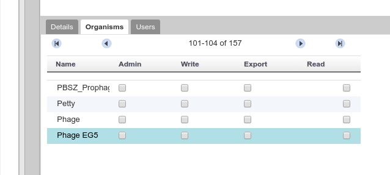
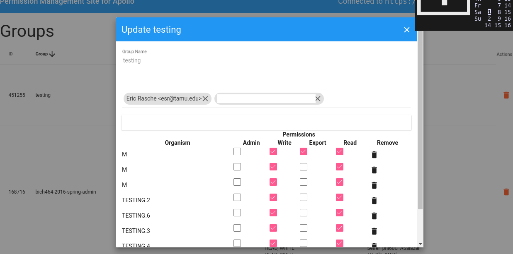
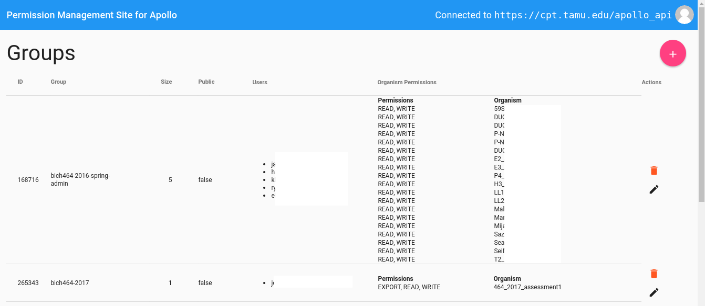
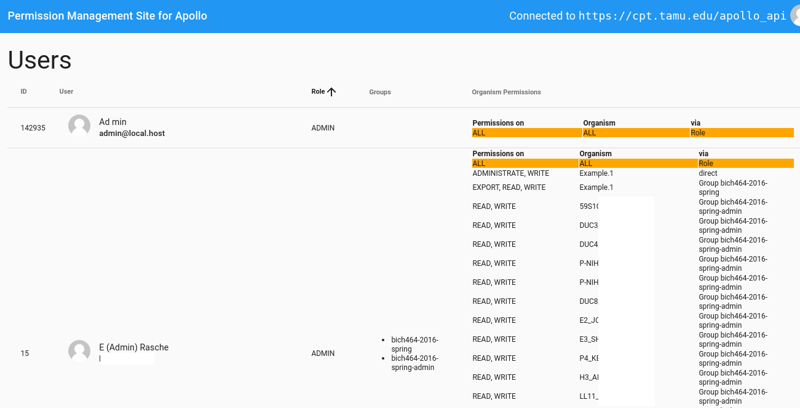

# apollo-permissions-manager

An AngularJS frontend for managing permissions in Apollo. If you add the cors
headers mentioned below, you can use our site for doing this, no need to deploy
your own copy (unless you don't trust us, but we promise we do not keep copies
of your credentials).

## Screenshots

The current group permission management screen is a bit small for hundreds of organisms:



Our version uses the full screen and is focused solely on group and user permissions



The group management screen gives a view at a glance which groups have access to which organisms and at what level:



Lastly, our User permission view allows you to audit all user permissions, seeing which users have access to which organisms, and how! (I.e. via a group membership, or directly on the organism)




## Setup

Requires NodeJS / NPM to be installed

```
make build # Will compile into the build directory
make       # Launch the server (Will reload on any JS changes.)
```

## CORS Headers

```apache2
<Location "/apollo">
# https://benjaminhorn.io/code/setting-cors-cross-origin-resource-sharing-on-apache-with-correct-response-headers-allowing-everything-thro#
Header always set Access-Control-Allow-Origin "*"
Header always set Access-Control-Allow-Methods "POST, GET, OPTIONS, DELETE, PUT"
Header always set Access-Control-Max-Age "1000"
Header always set Access-Control-Allow-Headers "x-requested-with, Content-Type, origin, authorization, accept, client-security-token"

RewriteCond %{REQUEST_METHOD} OPTIONS
RewriteRule ^(.*)$ $1 [R=200,L]
</Location>
```

## Deploying

*Should* be as simple as `make deploy`

## LICENSE

AGPLv3

## Support

This material is based upon work supported by the National Science Foundation under Grant Number (Award 1565146)
